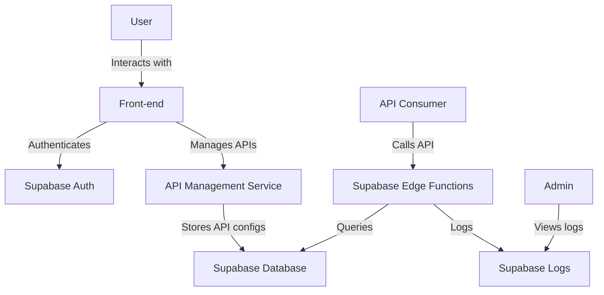

## This is a

```mermaid
graph TD
    A[User] -->|Interacts with| B[Front-end]
    B -->|Authenticates| C[Supabase Auth]
    B -->|Manages APIs| D[API Management Service]
    D -->|Stores API configs| E[Supabase Database]
    F[API Consumer] -->|Calls API| G[Supabase Edge Functions]
    G -->|Queries| E
    G -->|Logs| H[Supabase Logs]
    I[Admin] -->|Views logs| H
```

Here
