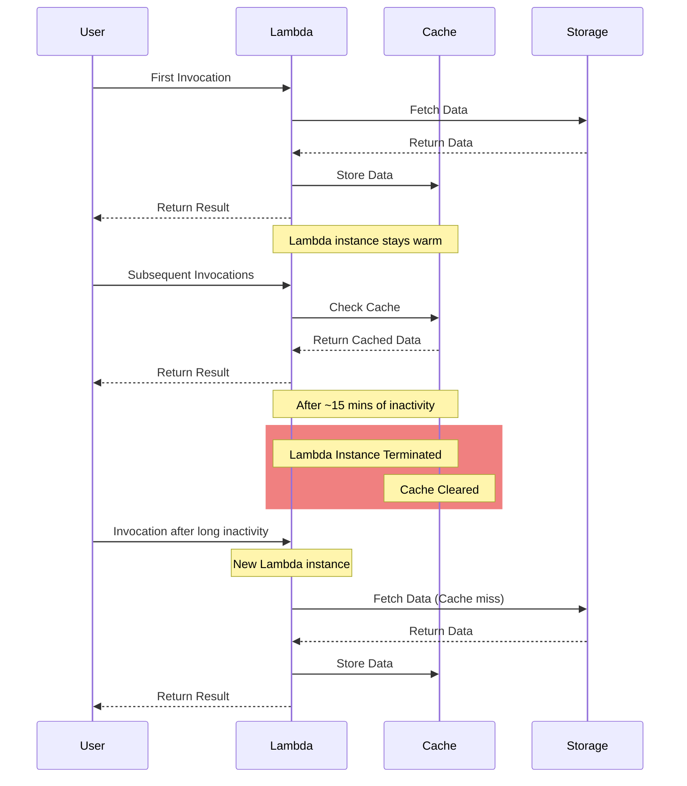

```mermaid
sequenceDiagram
    participant User
    participant Lambda
    participant Cache
    participant Storage

    User->>Lambda: First Invocation
    Lambda->>Storage: Fetch Data
    Storage-->>Lambda: Return Data
    Lambda->>Cache: Store Data
    Lambda-->>User: Return Result

    Note over Lambda,Cache: Lambda instance stays warm

    User->>Lambda: Subsequent Invocations
    Lambda->>Cache: Check Cache
    Cache-->>Lambda: Return Cached Data
    Lambda-->>User: Return Result

    Note over Lambda,Cache: After ~15 mins of inactivity

    rect rgb(240, 128, 128)
        Note over Lambda,Cache: Lambda Instance Terminated
        Note over Cache: Cache Cleared
    end

    User->>Lambda: Invocation after long inactivity
    Note over Lambda: New Lambda instance
    Lambda->>Storage: Fetch Data (Cache miss)
    Storage-->>Lambda: Return Data
    Lambda->>Cache: Store Data
    Lambda-->>User: Return Result
```
