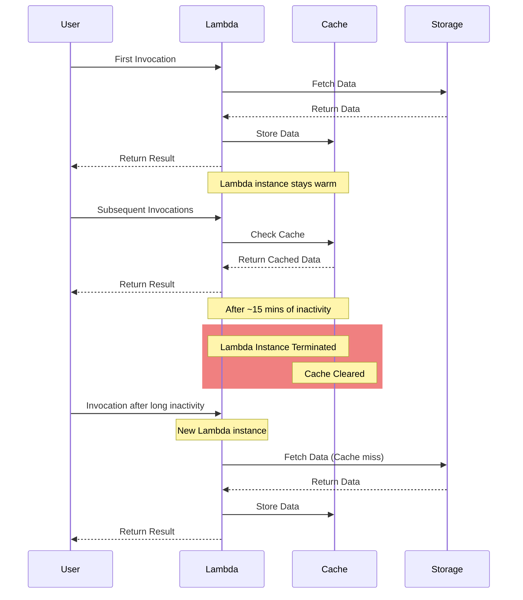

# Implementing Caching in AWS Lambda with Supabase

## Introduction

This guide demonstrates how to implement a caching mechanism for AWS Lambda functions that interact with Supabase storage. By using Lambda's `/tmp` directory, we can cache files between function invocations, significantly reducing the number of downloads from Supabase storage.

## Caching Implementation

### Step 1: Create a Cache Manager

First, create a new file named `api-cache.js` with the following content:

```javascript
const fs = require("fs").promises;
const path = require("path");

const cacheDir = "/tmp/api-cache";
const cacheExpiration = 5 * 60 * 1000; // 5 minutes in milliseconds

const metadataCache = new Map();

async function getCachedApiData(supabase, apiId) {
  const cacheKey = `api-${apiId}`;
  const metadataPath = path.join(cacheDir, `${apiId}-metadata.json`);
  const dataPath = path.join(cacheDir, `${apiId}-data.json`);

  try {
    // Check if metadata exists and is valid
    const metadata = await getMetadata(metadataPath, cacheKey);
    if (metadata && Date.now() - metadata.timestamp < cacheExpiration) {
      console.log(`Cache hit for API ${apiId}`);
      return JSON.parse(await fs.readFile(dataPath, "utf8"));
    }

    console.log(`Cache miss for API ${apiId}, downloading data`);

    // Ensure cache directory exists
    await fs.mkdir(cacheDir, { recursive: true });

    // Fetch new data
    const { data, error } = await supabase.storage
      .from("api-data")
      .download(`${apiId}/data.json`);
    if (error) throw error;

    const jsonData = JSON.parse(await data.text());

    // Write data to file
    await fs.writeFile(dataPath, JSON.stringify(jsonData));

    // Update metadata
    await updateMetadata(metadataPath, cacheKey);

    return jsonData;
  } catch (error) {
    console.error(`Error fetching or caching data for API ${apiId}:`, error);
    throw new Error("Failed to fetch API data");
  }
}

async function getMetadata(metadataPath, cacheKey) {
  try {
    // Check in-memory cache first
    if (metadataCache.has(cacheKey)) {
      return metadataCache.get(cacheKey);
    }

    // If not in memory, try to read from file
    const metadata = JSON.parse(await fs.readFile(metadataPath, "utf8"));
    metadataCache.set(cacheKey, metadata);
    return metadata;
  } catch (error) {
    // If file doesn't exist or is invalid, return null
    return null;
  }
}

async function updateMetadata(metadataPath, cacheKey) {
  const metadata = { timestamp: Date.now() };
  await fs.writeFile(metadataPath, JSON.stringify(metadata));
  metadataCache.set(cacheKey, metadata);
}

module.exports = { getCachedApiData };
```

#### Separate Data and Metadata:

- We now store the actual data and its metadata separately.
- This allows us to quickly check if the cache is valid without loading the entire dataset into memory.

#### Use of /tmp for Large Data:

- The main API data is stored in /tmp as JSON files.
- This allows handling of larger datasets that might not fit in memory.

#### Metadata Caching:

- We use a combination of in-memory caching (for quick access) and file-based storage (for persistence) for metadata.
- This hybrid approach allows for fast cache validity checks without consuming too much memory.

#### Error Handling and Directory Creation:

- The code now handles potential errors more robustly.
- It ensures the cache directory exists before trying to write to it.

#### Key Benefits:

- Memory Efficiency: Only metadata is kept in memory, while larger datasets are stored in /tmp.
- Persistence: Data persists in /tmp between invocations if the Lambda container is reused.
- Scalability: Can handle multiple large datasets for different APIs or users.
- Performance: Quick cache validity checks using metadata, without loading entire datasets.

### Step 2: Integrate Caching into Existing Code

Modify your main Lambda handler file to incorporate the new caching mechanism:

```javascript
const { createClient } = require("@supabase/supabase-js");
const { getCachedApiData } = require("./api-cache");

// ... (existing code for corsHeaders, parseQuery, and logApiCall)

// Update the processQuery function to use the cache
async function processQuery(supabase, apiId, operation, queryParams) {
  if (operation !== "search") throw new Error("Unknown operation");

  const jsonData = await getCachedApiData(supabase, apiId);
  const parsedQuery = parseQuery(queryParams);

  return jsonData.filter((item) =>
    Object.entries(parsedQuery).every(([key, condition]) => {
      const [operator, value] = Object.entries(condition)[0];
      const itemValue = item[key];
      switch (operator) {
        case "=":
          return itemValue == value;
        case "!=":
          return itemValue != value;
        case ">":
          return itemValue > value;
        case "<":
          return itemValue < value;
        case ">=":
          return itemValue >= value;
        case "<=":
          return itemValue <= value;
        default:
          return true;
      }
    })
  );
}

// Main Lambda handler (keep existing code, update imports at the top)
exports.handler = async (event) => {
  // ... (existing handler code)
};
```

## How It Works

1. The `api-cache.js` module manages the caching logic.
2. The cache utilizes both an in-memory `Map` and Lambda's `/tmp` directory for persistence between invocation, but not-persistent because it is only instance storage.
3. `getCachedApiData` checks if data is in the cache and still fresh (within 5 minutes). If so, it returns cached data; otherwise, it downloads from Supabase, caches it, and returns it.
4. The `processQuery` function now uses `getCachedApiData` instead of directly downloading from Supabase each time.

## Lambda Lifecycle and Caching Behavior



## Important Considerations

1. The `/tmp` directory, called Ephemeral storage, has a default 512 MB limit. Monitor usage if caching many large API data files.
2. Cache expiration is set to 5 minutes. Adjust based on your API data update frequency and specific requirements. /tmp cache is cleared if the lambda instance (executin environment) is terminated. While it is not clear how long the instance would last during inactivity, we expect and assume cache is only for repeated and iterated query usage pattern, meaning a API is query records 1 by 1.
3. Consider implementing a mechanism to manually invalidate the cache when API data is updated.

By implementing this caching strategy, you can significantly reduce the number of storage operations and improve the performance of your Lambda function, especially for frequently accessed APIs.
